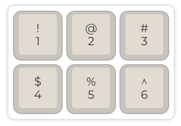

# 配列

键盘配列是一个宽泛的概念，可以按照物理、视觉、功能等方式划分。对于一般人来说，主要感知有三部分，按键数量、键位布局以及字母区布局。前两者是不同键盘硬件需要支持的能力，后者因为固件可定制化的特性，可以后期用软件随时调整。

其中直列键盘、分体键盘和人体工学键盘比较特殊，会在单独章节说明。

## 按标准

### ANSI

ANSI 是美国标准，也是我国市场上最常见的量产键盘标准。

### ISO/JIS

ISO 标准键盘最明显的特点就是回车键。在欧洲和日本等国比较流行。

## 按尺寸

键盘尺寸一般使用百分比或者键位数来表示，以104键大键盘为100%。

### 100%

传统量产键盘中最常见的配列，客制化中比较少见。

### 80%/TKL

80%键盘也成为 TKL（Ten-key less，没有数字小键盘），一般标准情况下87键。80%因为去除了很多人不常用的小键盘，整体变短了。Filco 等量产大厂也一直有80%的产品，用户的接受度比较高，是客制化中比较受欢迎的配列之一，适合保留自己使用习惯的玩家。

### 60%

60%是一个非常火爆的客制化配列，键位简单、对称、标准化程度高，可玩性强。

60%内部又分标准61键、标准62键、Tsangan、WKL、HHKB 60键、左移64键等子类。一般60%套件的焊接PCB，会同时兼容以上所有配列。

### 65%

65%键盘在60%基础上，增加了方向键和功能键，提升了便利性，是一个适应难度比较低但又功能比较强大的配列。

常见的65%分为66、67、68键。

**68键**

**67键**是客制化键盘中比较热门的配列，在68%的基础上减少了0.5U空间，替换为了一个 blocker。这样左侧区域刚好 1.25U x 3 + 6.25U + 1.25U x 2，比较整齐美观。

对于很多用小配列的玩家来说，右下角也没有必要跟左侧一样的 CTRL/ALT/Win，而是换成 FN 和一个别的按键，对于很少使用右侧功能键的玩家来说，67几乎没有多余的废键。

**66键**也称为660，源自 Leopold F660系列（存疑）。

### 75%

75%一般会有81-82键，比起60%系列的键盘，它增加了 ESC、F1-F12 一列按键，并且右侧采用类似65%一样的设计，可以保留方向键和 HOME/END/PAGEUP/PAGEDOWN 区中的4个键，从大键盘转过来没有什么适应成本。

75%通常会有两种风格，一种是 F1-F12 那排按键和传统键盘一样同数字键中间有空隙（如7V），还有一种是 F1-F12 紧贴在数字键上面（如 KBD75）。

#### 980

980配列基本保留了100%键盘的所有功能，按比例算是98%，它压缩了方向键区域的空间，实际宽度跟80%/TKL 键盘基本一致。适合既需要全键盘功能，又希望节省桌面空间的玩家。

### 小键盘/Pad

小键盘是一类配套的键盘，全尺寸的主要用于补充小配列键盘对于数字键的需求。同时，还有一些更小的键盘，只有不到10个按键。这类键盘主要用作特殊玩法，如：个性化键帽展示、主播镜头切换等。

### 40%

外形跟60%比较相似，但又少了顶部一排按键，通常是数字键。40%日常使用需要经常集合切层（可以认为是Fn）操作，甚至需要切多层，实际使用可能会不太方便。尤其使用中文输入法时。

## 按字母区布局

### QWERTY

### Colemak

### Dvorak

## 其它

### WKL

Win-key less，就是没有 Windows 键的布局，在量产键盘中常见于老式键盘。WKL 可以算一个属性，可以出现在不同尺寸的配列中。

## 备注

所有配列图片均由 QMK Configurator 生成。

